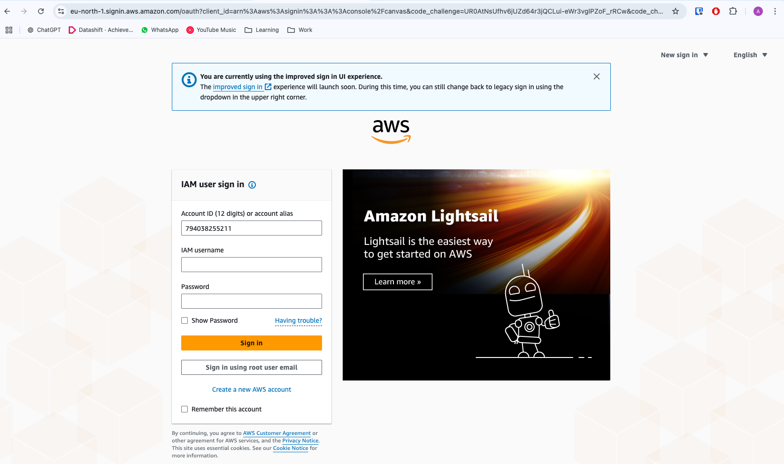
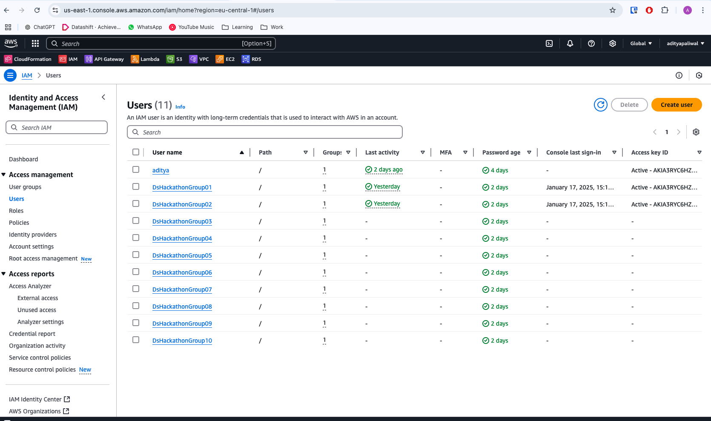
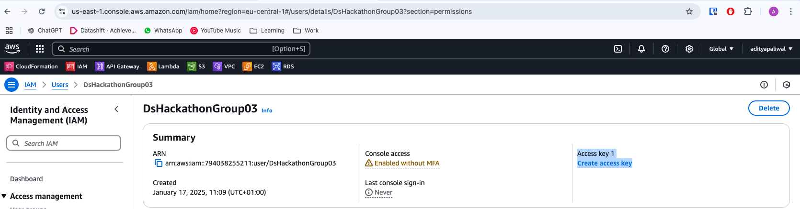
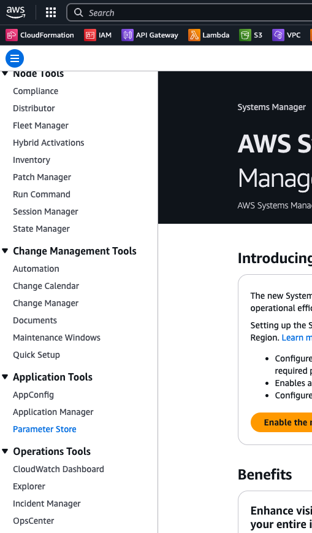

# Datashift Skills Tracker Starter Pack

## 1. Introduction

This GitHub repository provides a starter pack to help you build your own **Datashift Skills Tracker**. The goal is to use this starter pack as a foundation to create your own data model and CRUD operations for tracking employee skills within Datashift.

*Note: This starter pack uses Python and Flask to build the API, which is deployed on AWS API Gateway using AWS Lambda. While you are welcome to use this setup, we encourage you to create your own setup in any programming language of your choice.*

## 2. Project Structure

The repository includes the following files and directories:
```
├── Hackathon-datashift-Skills-Tracking-API
│   ├──deployment
│   │   ├── deploy_aws.sh
├── src
│   ├── app.py
│   ├── db.py
├── aws-template.yaml
├── Dockerfile
├── README.md
├── requirements.txt
└── .gitignore
```

Clone the repo to your preferred IDE using [this link:](https://github.com/adityapaliwal-ds/hackathon-datashift-skills-tracking-api.git). Go through each file and follow the instructions carefully to set up the project.

## 3. Prerequisites

Before you start, ensure that Docker is installed on your system, as it is required to build and run the application.

## 4. Setup Instructions

#### 1. **Prepare your AWS access kays for CLI:**

   - User accounts for each user/team are already created. Make sure you have the credentials to start login and creating access keys for AWS CLI. 
   - If by this time you lack credentials to login, we suggest to reach out to one of the organizers.
   - Login to the aws console using [this link](https://aws.amazon.com/console/)
   
   Follow the sign in option on this screen:

   

   Login as an IAM user by entering the account id, username and password: 

   

   - Once you login, look for IAM in the navigation bar, Look into users, and then click on your username to create access keys. 
   
   

   

   *Note: Keep the keys stored in some accessable locaton because, secret-access-key, if lost, it needs to be created again.*
   
#### 2. **Update the AWS CloudFormation Template:**

   - Open the `aws_template.yaml` file.
   - Update the `UsernameTag` parameter with your group number:
   
     ```yaml
     Parameters:
       UsernameTag:
         Type: String
         Description: The team or group name to be used as the tag value
         Default: DsHackathonGroupX  # Replace X with your group number
     ```

#### 3. **Build the Docker Image:**

   Open a terminal and run the following command to build the Docker image:

   ```bash
   docker build -t datashift-skill-api-groupX .
   ```
   - Replace X with your group number.
  
#### 4. **Run the Docker Container:**

  Run the following command, passing your AWS access keys, and region as environment variables:

  ```bash
  docker run -d \
  -e AWS_ACCESS_KEY_ID="your-aws-access-key" \
  -e AWS_SECRET_ACCESS_KEY="your-aws-secret-access-key" \
  -e AWS_DEFAULT_REGION="eu-central-1" \
  -p 5000:5000 datashift-skill-api-groupX
  ```
  - Replace X with your group number.
  - The above command will return the containerId for your active container

#### 5. **Access the Container Shell:**

  To enter the container shell, run the following command:
  
  ```bash
  docker exec -it <container-id> /bin/bash
  ```

#### 6. **Deploy the AWS Resources:**

  Run the deployment script:

  ```bash
  ./deployment/aws/deploy_aws.sh
  ```

  - During the deployment, you'll be prompted to enter some configuration values. Provide the following inputs:

      - Stack Name[sam-app]: DsHackathonGroupX (Replace X with your group number)
      - AWS Region[eu-central-1]: press enter
      - Parameter UsernameTag[DsHackathonGroupX]: press enter (cross check this with what you have entered in your **aws-templaye.yaml** file, in step 2)
      - Confirm changes before deploy[y/N]: y
      - Allow SAM CLI IAM role creation[Y/N]: Y
      - Disable rollback[y/N]: N
      - FlaskAppFunction has no authentication. Is this okay?[y/N]: y
      - Save arguments to configuration file[Y/N]: Y
      - SAM Configuration File[samconfig.toml]: press enter
      - SAM Configuration Environment[default]: press enter
  
  *Note: Step 6 can be executed in Docker UI as well if you prefer. Navigate to containers, select the running container and open the terminal to trigger the deployment script.*


## 5. Accessing the database locally
  By now, your PostgreSQL database should be running on AWS. You can connect to it locally using a database management tool like DBeaver.

  To Connect to the Database:
  
    - Open DBeaver and create a new database connection.
    - Select PostgreSQL as the database type.
    - Connect using Host (not URL).
    - Enter the following connection details:
        - Host: <your-db-host>
        - Database: postgres
        - Username: hackathonuser
        - Password: <your-db-password> 
        
  *Note: The database password is securely stored under AWS Systems Manager --> Parameter Store*
  

## 6. Points to remember:
  When working with the setup, keep the following points in mind:

  - There are three code environments involved:
    - The code you modify locally on your PC.
    - The code copied into the Docker container.
    - The code deployed on AWS Lambda.

  - Any changes to the code, such as updating the database host or adding a new endpoint, require the following steps:

    - Kill the currently running container.
    - Rebuild the Docker image using docker build to ensure the changes are incorporated into the container.
    - Redeploy the updated container code to AWS Lambda.

  - **Tip:** To streamline development and avoid rebuilding the container for every change, you can **mount your local directory to the container's root directory** using Docker's bind mount feature. This allows real-time updates to your code within the running container. For more info on this, follow [this link:](https://docs.docker.com/engine/storage/bind-mounts/)

## 7. AWS Walkaround:

